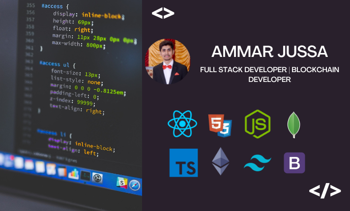

 

<h1 align="center">Hi, I'm Ammar Jussa! </h1>
<h3 align="center">Full Stack Web and Mobile Application Developer</h3>

  
  

 

  &nbsp;&nbsp;
  &nbsp;&nbsp;
  &nbsp;&nbsp;

  

- 🌱 I’m currently learning **Web3.0 (Metamask, Web3.js, Ethers.js, Solidity, SmartContract Integration)**

- 🔭 BS Computer Science Graduate from LUMS. 

- 💬 Ask me about **ReactJS, NextJS, NodeJS, etc.**

- 📫 How to reach me **ammar26497@gmail.com**

- 💼 Portfolio: **https://www.ammarjussa.com**

<h2 align="left">Skills </h2>

                  

<h2> My GitHub Stats  </h2>

<a href="https://github.com/ammarjussa"> 

</a>

 

<a href="https://github.com/ammarjussa"> 

 </a>

